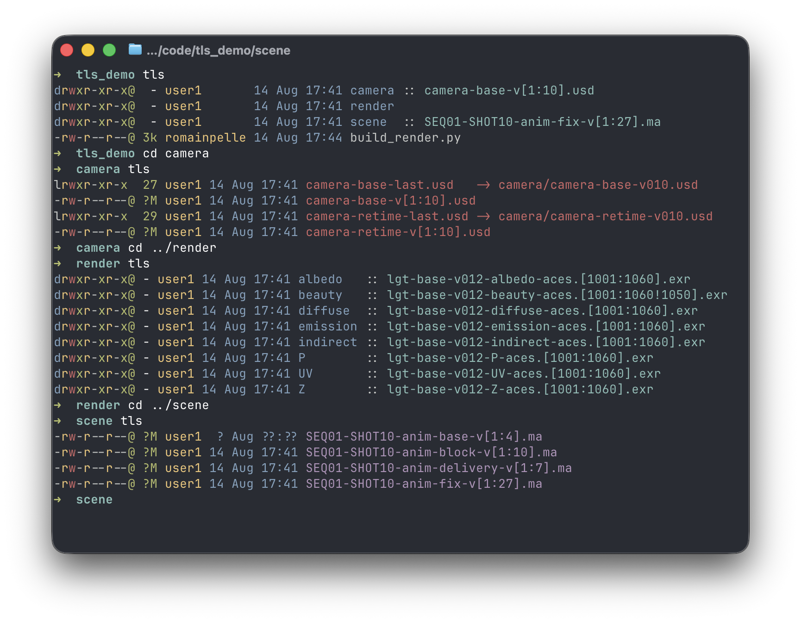
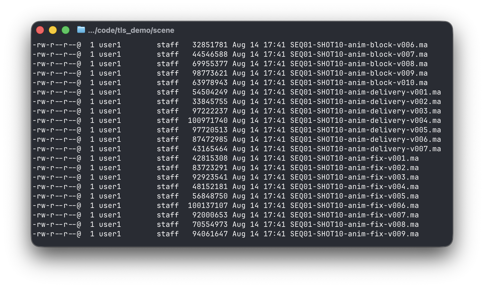
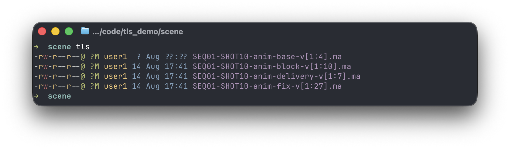
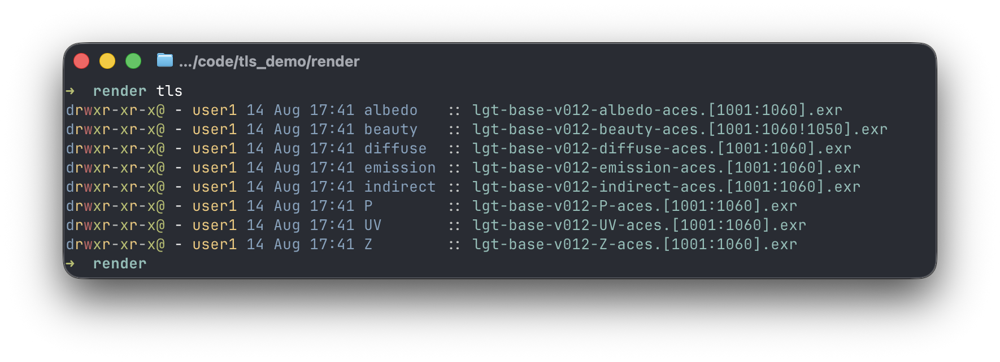

<div align="center">

# tls

ls -l variant, tweaked for vfx / animation



</div>

---

## Overview

`tls` is a replacement for `ls -l`.

Aimed at technical directors, pipeline developers and technical people
from the industry, who have to deal with directories full of sequences of
render frames, image caches, versioned scene files. 

Plain `ls` buries you in sequences files. `tls` detects the sequence and 
collapses it into one line with a compact frame range.

Theme based on [exa](https://github.com/ogham/exa)<br>

## Sequence notation

```
name.[1:5].exr           frames 1 through 5, all present
name.[2:6 10:24 29].exr  three runs: 2–6, 10–24, and a lone 29
name.[3:7!6].exr         run 3–7 with frame 6 missing
name.[3:19!!].exr        run 3–19 with too many gaps to list individually
```

## Sequence collapsing

tls groups together contiguous files in a directory. It does this without any
regexp or a pattern you have to supply. Zero-padded and non-padded sequences
both work (`v001` and `v1`). Any sequence should work.

When a sequence is collapsed, a `?` means the grouped files don't share that
property:

```
Size:
?   sizes are too different to summarise
?M  sizes differ, but all land in the megabyte range

Date:
 ? Jan 2026   all modified in January 2026, but on different days
 ?  ?  2026   all modified in 2026, but different months

Permissions:
-r?-r--r--    not all of them are writable
```

Here is a directory holding different variants of a Maya animation scene. With
tls you can see which versions of each variant exist at a glance.

using ls:


using tls:


## Sequences inside sub-directories

Directories are annotated with their dominant inner sequence.

A good example of where this is useful is a render directory, which usually
consists of one subdir per render pass / AOV. With tls you get a quick summary
of the render state straight from the top-level render directory.

Here you can see that one frame failed to render in the beauty pass.



## Colors

Filenames are coloured by type, geared towards the vfx / animation world:

- images (exr, jpg, jpeg, png): green
- dcc scenes (ma, nk, hip, c4d, zpr): magenta
- caches (ass, abc, fbx, usd): red
- video (mp4, mkv, mov, mpeg): cyan
- directories: blue
- anything else: white

## Build & run

Requires Zig 0.15.2.
Runs on macOS / Rocky Linux.

```sh
make test                # run all tests
make build               # build tls bin
./zig-out/bin/tls <path> # run the bin
```
